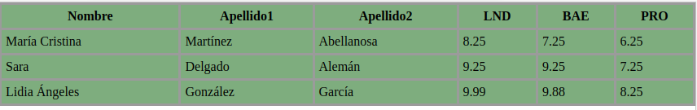
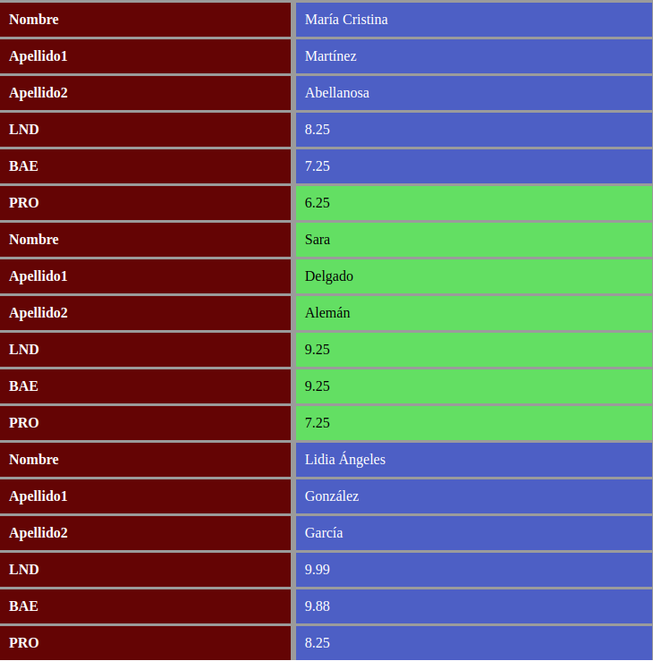

# Tarea Reponsive

<br>

### Codigo del html

<br>

---

```html
<!DOCTYPE html PUBLIC "-//W3C//DTD XHTML 1.0 Strict//EN" "http://www.w3.org/TR/xhtml1/DTD/xhtml1-strict.dtd">
<html xmlns="http://www.w3.org/1999/xhtml" lang="es" xml:lang="es">
	<head>
		<meta http-equiv="Content-Type" content="text/html; charset=UTF-8" />
		<meta name="author" content="Cesar Dominguez Romero"/>
		<title></title>
		<link rel="stylesheet" href="./Estilos/Index.css">
	</head>
	<body>

		<div class="contenedor">
			
			<p> Lorem ipsum dolor sit amet, consectetur adipisicing elit, sed do eiusmod
			tempor incididunt ut labore et dolore magna aliqua. Ut enim ad minim veniam,
			quis nostrud exercitation ullamco laboris nisi ut aliquip ex ea commodo
			consequat. 
			</p>
			<p> Duis aute irure dolor in reprehenderit in voluptate velit esse
			cillum dolore eu fugiat nulla pariatur. Excepteur sint occaecat cupidatat non
			proident, sunt in culpa qui officia deserunt mollit anim id est laborum.
			</p>
			<p> Lorem ipsum dolor sit amet, consectetur adipisicing elit, sed do eiusmod
			tempor incididunt ut labore et dolore magna aliqua. Ut enim ad minim veniam,
			quis nostrud exercitation ullamco laboris nisi ut aliquip ex ea commodo
			consequat. Duis aute irure dolor in reprehenderit in voluptate velit esse
			cillum dolore eu fugiat nulla pariatur. Excepteur sint occaecat cupidatat non
			proident, sunt in culpa qui officia deserunt mollit anim id est laborum.
			</p>
			<p class="letraCapital"> Lorem ipsum dolor sit amet, consectetur adipisicing elit, sed do eiusmod
			tempor incididunt ut labore et dolore magna aliqua. Ut enim ad minim veniam,
			quis nostrud exercitation ullamco laboris nisi ut aliquip ex ea commodo
			consequat. Duis aute irure dolor in reprehenderit in voluptate velit esse
			cillum dolore eu fugiat nulla pariatur. Excepteur sint occaecat cupidatat non
			proident, sunt in culpa qui officia deserunt mollit anim id est laborum.
			</p>
		</div>


	</body>
</html>
```
---

<br>

### Codigo del CSS

<br>

---
```css
.body, *{
    margin: 0;
    padding: 0;
    box-sizing: border-box;
}

.calificaciones{
    width: 100%;
    border-collapse: collapse;
    background-color: rgb(126, 173, 126);
}

.calificaciones tr th{
    color: rgb(0, 0, 0);
    border: 3px solid #9b9b9b;
    padding: 5px;
    text-align: center;
}

.calificaciones tr td{
    border: 3px solid #9b9b9b;
    padding: 5px;
}

.tabla-mobile{
    display: none;
}
.tabla-mobile .fila .columna{
    display: flex;
}
.tabla-medio .fila .columna .header .contenido {
    background-color: lightgreen;
}

.tabla-mobile .fila .columna .header, .tabla-mobile .fila .columna .contenido{
    border: 3px solid #9b9b9b;
    border-bottom: none;
    padding: 10px;
}

.tabla-mobile .fila .columna .header{
    width: 45%;
    background-color: #640404;
    color: white;
    font-weight: bold;
}

.tabla-mobile .fila .columna .contenido{
    width: 55%;
}

.tabla-mobile .fila .columna .contenido{
    background-color: rgb(77, 95, 197);
    color: white;
}
.tabla-mobile .fila:nth-child(6) .columna .contenido{
    background-color: rgb(99, 223, 99);
    color: black;
}
.tabla-mobile .fila:nth-of-type() .columna .contenido{
    background-color: rgb(77, 95, 197);
    color: white;
}

.tabla-mobile .fila .columna:last-of-type .contenido .header, 
.tabla-mobile .fila .columna:last-of-type .contenido .header{
    border-bottom: 5px solid #3d3c3c;
}


@media (max-width: 768px){
    .tabla-mobile{
        display: block;
    }
    .calificaciones{
        display: none;
    }
}
```
---

<br>

## Resultado final

<br>

---



<br>

