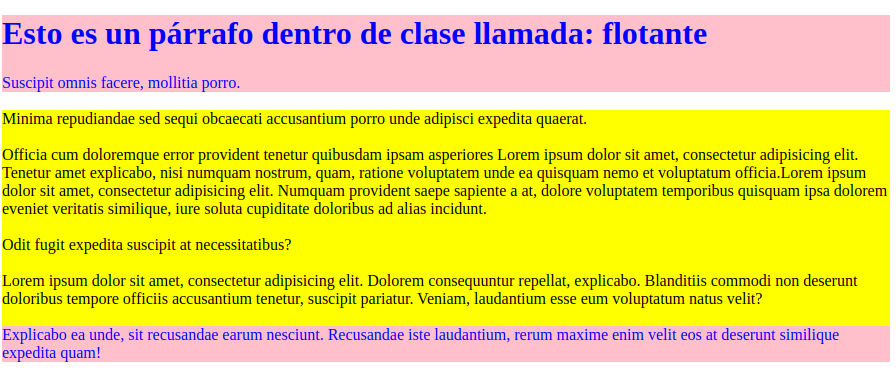

# Tarea Repaso

<br>

### Codigo del html

<br>

---

```html
<!DOCTYPE html PUBLIC "-//W3C//DTD XHTML 1.0 Strict//EN" "http://www.w3.org/TR/xhtml1/DTD/xhtml1-strict.dtd">
<html xmlns="http://www.w3.org/1999/xhtml" lang="es" xml:lang="es">
    <head>
        <meta http-equiv="Content-Type" content="text/html; charset=UTF-8" />
            <title>Tarea dia 16</title>
            <link rel="stylesheet" href="./Estilos/Index.css">
    </head>
    <body>
        <div class="flotante">
            <H1>Esto es un párrafo dentro de clase llamada: flotante</H1>
            <span>Suscipit omnis facere, mollitia porro.</span>
        </div>
        <br>
        <div class="article">
            <span>Minima repudiandae sed sequi obcaecati accusantium porro unde adipisci expedita
                quaerat.</span>
            <br>
            <br>
            <span>Officia cum doloremque error provident tenetur quibusdam ipsam asperiores Lorem
                ipsum dolor sit amet, consectetur adipisicing elit. Tenetur amet explicabo, nisi numquam
                nostrum, quam, ratione voluptatem unde ea quisquam nemo et voluptatum officia.Lorem
                ipsum dolor sit amet, consectetur adipisicing elit. Numquam provident saepe sapiente a
                at, dolore voluptatem temporibus quisquam ipsa dolorem eveniet veritatis similique, iure
                soluta cupiditate doloribus ad alias incidunt.</span>
            <br>
            <br>
            <span>Odit fugit expedita suscipit at necessitatibus?</span>
            <br>
            <br>
            <span>Lorem ipsum dolor sit amet, consectetur adipisicing elit. Dolorem consequuntur repellat,
                explicabo. Blanditiis commodi non deserunt doloribus tempore officiis accusantium
                tenetur, suscipit pariatur. Veniam, laudantium esse eum voluptatum natus velit?</span>
            <br>
            <br>
        </div>
        <div class="article">
            <span>Explicabo ea unde, sit recusandae earum nesciunt. Recusandae iste laudantium, rerum
                maxime enim velit eos at deserunt similique expedita quam!</span>
        </div>
    </body>
</html>
```
---

<br>

### Codigo del CSS

<br>

---
```css
.flotante{
    background-color: pink;
    color: blue;
}

div:nth-child(even) {
    background-color: pink;
    color: blue;
}

div:nth-child(odd):not(:first-child) {
    background-color: yellow;
    color: black;
}
```
---

<br>

## Resultado final

<br>

---

