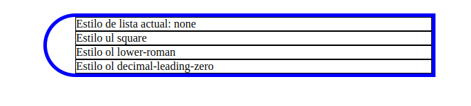
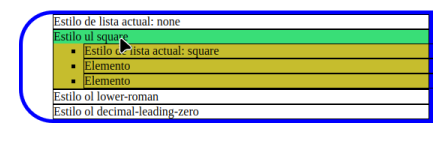
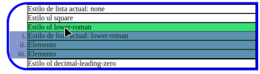
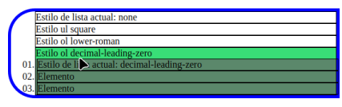

# Tarea DISPLAY:NONE

<br>

### Codigo del html

<br>

---

```html
<!DOCTYPE html PUBLIC "-//W3C//DTD XHTML 1.0 Strict//EN" "http://www.w3.org/TR/xhtml1/DTD/xhtml1-strict.dtd">
<html xmlns="http://www.w3.org/1999/xhtml" lang="es" xml:lang="es">
    <head>
        <meta http-equiv="Content-Type" content="text/html; charset=UTF-8" />
        <meta name="author" content="Cesar Dominguez"/>
        <title>Tarea display:none</title>
        <link rel="stylesheet" href="./Estilos/Index.css">
    </head>
    <body>
        <ul class="none">
            <li>Estilo de lista actual: none</li>
            <li>Estilo ul square
                <ul class="square">
                  <li>Estilo de lista actual: square</li>
                  <li>Elemento</li>
                  <li>Elemento</li>
                </ul>
            </li>
            <li>Estilo ol lower-roman
                <ol class="lower-roman">
                      <li>Estilo de lista actual: lower-roman</li>
                      <li>Elemento</li>
                      <li>Elemento</li>
                </ol>
            </li>
            <li>Estilo ol decimal-leading-zero
                <ol class="decimal-leading-zero">
                  <li>Estilo de lista actual: decimal-leading-zero</li>
                  <li>Elemento</li>
                  <li>Elemento</li>
                </ol>
            </li>
        </ul>

    </body>
</html>
```
---

<br>

### Codigo del CSS

<br>

---
```css
body {
    justify-content: center;
    display: flex;
}

ul {
    list-style: none;
}

.none {
    border: 5px solid blue;
    border-top-left-radius: 45px;
    border-bottom-left-radius: 45px;
}

li {
    border: 1px solid black;
    width: 500px;
}

li:hover {
    background-color: #39d173;
}

.square {
    background-color: #C6BD2D;
    list-style: square;
}

.lower-roman {
    background-color: #6980c5;
    list-style: lower-roman;
    opacity: 80%;
    margin-left: -40px;
}

.decimal-leading-zero {
    background-color: #547760;
    list-style: decimal-leading-zero;
    padding-left: 2px;
}

.square, .lower-roman, .decimal-leading-zero {
    display: none;
}

li:hover > .square, li:hover > .lower-roman, li:hover > .decimal-leading-zero {
    display: block;
}
```
---

<br>

## Resultado final

<br>

---




