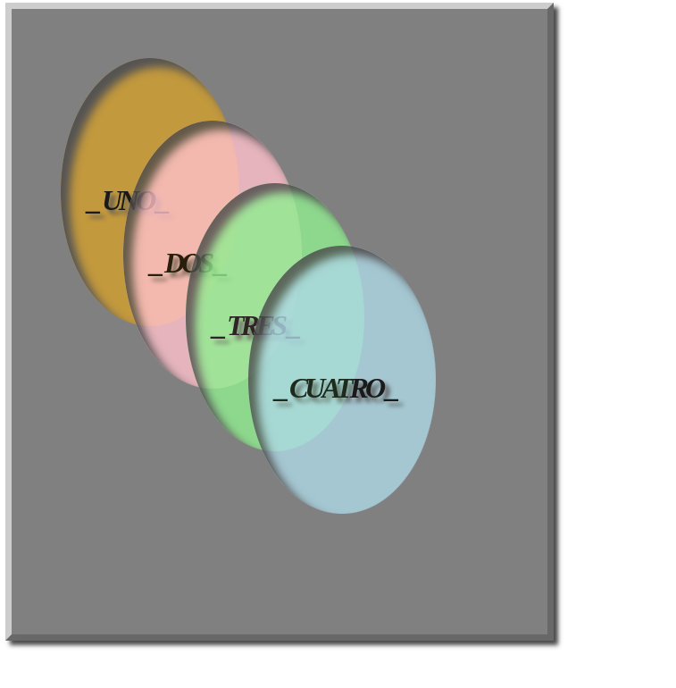

# Tarea Letter spacing

<br>

### Codigo del html

<br>

---

```html
<!DOCTYPE html PUBLIC "-//W3C//DTD XHTML 1.0 Strict//EN" "http://www.w3.org/TR/xhtml1/DTD/xhtml1-strict.dtd">
<html xmlns="http://www.w3.org/1999/xhtml" lang="es" xml:lang="es">
    <head>
        <meta name="author" content="Cesar Dominguez"/>
        <title>ZIndex</title>
        <link rel="stylesheet" href="./Estilos/Index.css">
    </head>
    <body>
        <div class="contenedor">
            <div class="caja">
                <h1> _ UNO _ </h1>
            </div>
            <div class="caja">
                <h1> _ DOS _ </h1>
            </div>
            <div class="caja">
                <h1> _ TRES _</h1>
            </div>
            <div class="caja">
                <h1> _ CUATRO _ </h1>
            </div>
        </div>            
    </body>
</html>
```
---

<br>

### Codigo del CSS

<br>

---
```css
.contenedor {
    display: flex;
    font-family: Georgia, serif, Cambria;
    font-style: oblique;
    font-kerning: auto;
    letter-spacing: -4px;
    box-shadow: 5px 5px 5px #494848;
    width: 600px;
    height: 700px;
    background-color: gray;
    border-left: 7px solid rgb(205, 205, 205);
    border-top: 7px solid rgb(205, 205, 205);
    border-bottom: 7px solid rgb(104, 104, 104);
    border-right: 7px solid rgb(104, 104, 104);
}

.contenedor .caja {
    width: 200px;
    height: 300px;
    opacity: 80%;
    transition: 0.3s;
    position: absolute;
    border-radius: 50%;
    box-shadow: inset 10px 10px 10px #494848;
}

.contenedor .caja:hover {opacity: 93%;}

.caja:hover ~ .caja:nth-child(n+1) {opacity: 0%;}

.contenedor .caja h1 {
    position: relative;
    top: 120px;
    margin-left: 30px;
    text-shadow: 5px 5px 5px #494848;
}

.contenedor .caja:nth-child(1) {
    background-color: rgba(255, 174, 0, 0.658);
    top: 70px;
    left: 70px;
}

.contenedor .caja:nth-child(2) {
    background-color: pink;
    top: 140px;
    left: 140px;
}

.contenedor .caja:nth-child(3) {
    background-color: lightgreen;
    top: 210px;
    left: 210px;
}

.contenedor .caja:nth-child(4) {
    background-color: lightblue;
    top: 280px;
    left: 280px;
    padding-right: 10px;
}
```
---

<br>

## Resultado final

<br>

---

